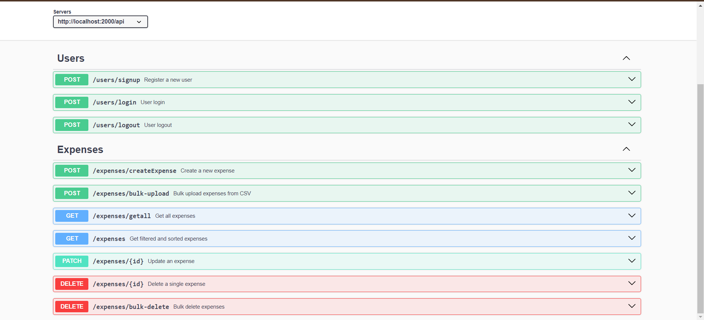

<h1 align="center">MERN-Backend Expense_Tracker</h1>


About This project:

-   ⚛️ Tech Stack:  Node.js, Express.js, MongoDB
-   🎥 csv file Uploading using multer 
-   🔐 Authentication with JWT
-   🔐 Authentication & Authorizations 
-   🔐 JWT Token Verification 
-   🎬 Fetch Expense By Sorting , serching 
-   🎬 Add Bulk Data and singular expense
-   🎬 Delete Bulk and Single expense
-   🎬  Update Expense
-   🐱‍👤 Get Similar Expense Creation API


## Expense Swagger UI



This is the dashboard view of the Expense Tracker Application where users can view and manage their expenses with filtering, sorting, and bulk deletion features.


### Setup .env file

```bash
DATABASE_URL=Your_mongo_url
PORT=Sevice_port
NODE_ENV=NODE_ENVIRINMENT
JWT_SECRET=jwt_secret
```

### Run this app locally

```shell
npm run build
```

### Start the app

```shell
npm start
```
